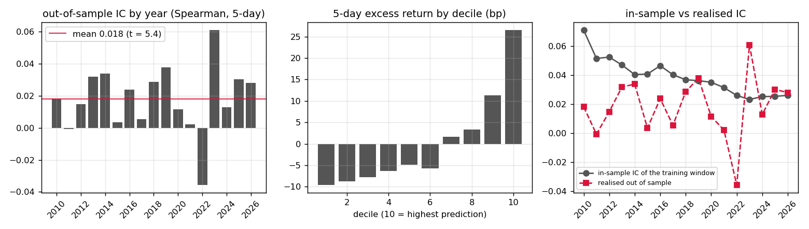
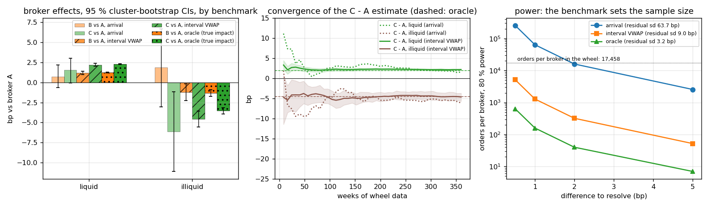
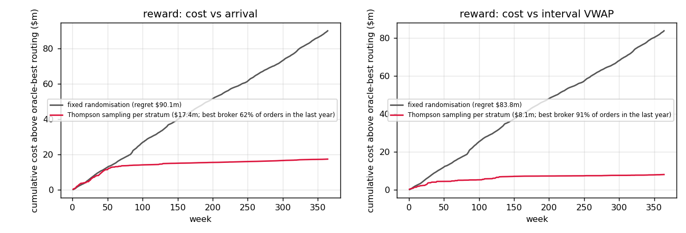
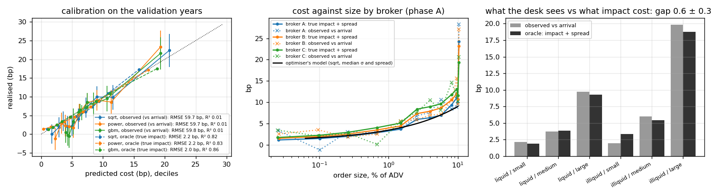
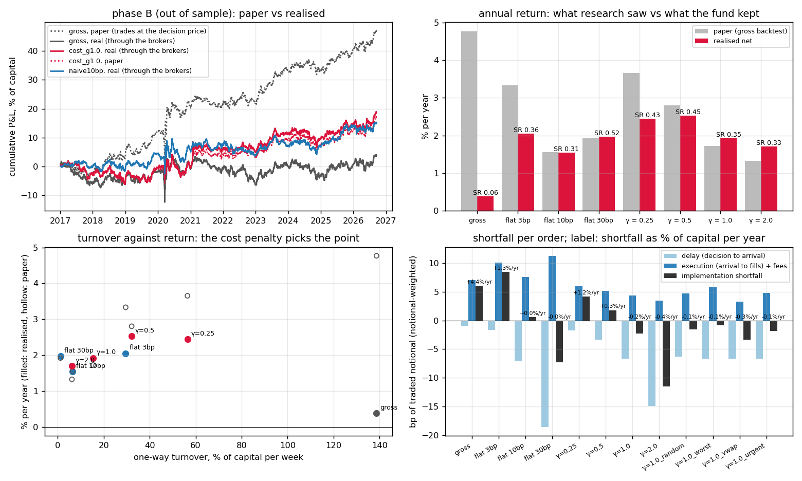

# algo-wheel — broker algo wheel, pre-trade cost model and the research handoff

**Question.** A research team hands the trading desk an equity signal with a gross backtest. What does the desk hand back? Three things, each measured here: *which broker algorithm to route to* (a wheel run as a randomised experiment, with the sample size the answer needs), *what an order of a given size will cost* (a pre-trade model fitted on the wheel's fills and tested out of sample), and *how much of the signal's gross return survives* once that cost model sits inside the portfolio optimiser and the trades go through the brokers.

**Answer (§Results).**

- *The wheel.* The benchmark decides whether the experiment can work at all. Measured against the arrival price, an order's cost has a residual sd of 64 bp and resolving a 1 bp broker difference at 80 % power needs 63,775 orders per broker; the seven-year wheel had 17,458 and could not separate the brokers in liquid names. Measured against the interval VWAP the sd is 9 bp, 1,283 orders suffice, and the same orders give A cheapest in liquid names (B +1.18 bp [1.00, 1.38], C +2.20 [2.02, 2.38]) and C cheapest in illiquid ones (−4.58 [−5.57, −3.57]), the map the oracle confirms in every stratum but one where the true gap is 0.5 bp; the interval excludes zero after 8 weeks in liquid names and 48 in illiquid. Routing by that map rather than at random is worth 1.0 % of capital a year on the gross book (+0.38 % against −0.66 %) and 0.06 % on the cost-aware one. Randomising for seven years costs $84m against oracle-best routing, a one-year wheel $12.5m, Thompson sampling per stratum $8m while picking the best broker on 91 % of orders in its last year.
- *The pre-trade model.* Per order the desk's model explains almost nothing (R² 0.01 out of sample: a 7 bp mean under 60–90 bp of drift noise) yet its decile calibration holds (predicted 20.7 bp, realised 22.4 ± 2.2) and against the oracle the square-root law explains 82 % (gradient boosting 86 %). Fitted on observed costs the impact coefficient is 0.25; on the oracle it is 0.16: the orders' own alpha sits in the target and the desk overstates impact by half. Out of sample on 2017–2026 orders the square-root model predicts the cost level within 1.1 bp RMSE against 7.5 bp for the calibration-period mean; the free-exponent spec (β = 0.30) extrapolates worse (2.3 bp).
- *The handoff.* Out of sample the gross book earns 4.8 % a year on paper (Sharpe 0.79) and 0.4 % for real: 139 % weekly turnover at 6 bp an order is 4.4 % of capital a year. With the fitted cost model inside the optimiser at the γ = 1 chosen on 2010–2016, turnover falls to 15 % a week, paper return to 1.7 % and realised return rises to 1.9 % (Sharpe 0.35); γ = 0.5 would have kept 2.5 % (Sharpe 0.45), in the direction the multi-period theory predicts. A flat cost per unit turnover did as well in the calibration years (10 bp: 3.5 % against 3.3 %) but does not travel: 3, 10 and 30 bp give 2.1, 1.5 and 2.0 % out of sample at 30, 6 and 1 % weekly turnover, the last a near-static book, while the σ√(Q/ADV) model rescales itself as the median order falls from 3.2 % to 1.1 % of ADV. Realised beating paper at low turnover is not a free lunch from execution: execution cost proper stays at 4.1 bp; the delay term turns to −6.6 bp because the reversal-heavy signal's names keep moving between Friday's close and Monday's open, so the patient book buys lower than the paper book did. A VWAP schedule for every order beats the size-based and the urgent policies (2.0 % against 1.9 %) for the same reason.

Python package `xcost`: an ordinary walk-forward ML signal on 156 US large caps, a convex optimiser (cvxpy / Clarabel) with a transaction-cost penalty, a reduced-form intraday market with three simulated brokers and an oracle, the wheel estimator with cluster bootstrap and power analysis, Thompson sampling against fixed randomisation, three pre-trade specifications, and a two-book backtest whose paper-minus-real gap is exactly the summed implementation shortfall. 16 tests, CI, `notebooks/results.ipynb`, `report.pdf`.

---

## Layout

| path | what |
|---|---|
| `xcost/data.py` | daily bars (committed parquet), rolling ADV, volatility, the spread rule, week starts |
| `xcost/signal.py` | eight features rank-normalised per day, 5-day cross-sectional target, ridge + gradient boosting refit each January walk-forward, IC, Grinold alpha |
| `xcost/risk.py` | Ledoit–Wolf covariance over 250 days, scaled to the 5-day horizon |
| `xcost/optimizer.py` | mean-variance with the cost penalty (`CostModel`: square-root, power or flat linear), dollar neutrality, position, gross and per-order ADV caps |
| `xcost/market.py` | the intraday market (bridge, volume curve, spread, impact) and brokers A/B/C with VWAP / TWAP / POV / IS / CLOSE schedules; every fill carries its impact-free twin |
| `xcost/backtest.py` | weekly loop: alpha → optimiser → orders → routing (stratified wheel, best, worst, random, fixed) → fills → two books; Perold decomposition per order |
| `xcost/wheel.py` | the experiment: OLS with broker effects and a broker × liquidity interaction, cluster bootstrap over days, P(best), power, learning curve, oracle check, Thompson sampling vs fixed randomisation |
| `xcost/pretrade.py` | sqrt / power / gradient-boosting cost models, calibration by decile, alpha contamination, the optimiser's reduced form |
| `xcost/run.py` | `python -m xcost signal | calibrate | handoff | all [--quick] [--resume]` → `results/*.json`, run parquets |
| `configs/pipeline.json` | periods, optimiser limits, γ grid, flat-cost grid, bootstrap size, seed |
| `tests/`, `.github/workflows/ci.yml` | 16 tests (market invariants, optimiser constraints, wheel on a synthetic experiment with known effects, pre-trade recovery of a known law, Perold identity, one end-to-end pass on the data); CI runs them plus the quick pipeline |
| `scripts/run_all.sh`, `plots.py`, `summarize.py`, `report.py` | pipeline, figures, `results/summary.md`, `report.pdf`; `notebooks/results.ipynb`; `tools/download.py` refreshes the data |

Run: `pip install numpy pandas pyarrow scipy scikit-learn cvxpy clarabel matplotlib fpdf2 pytest`, then `scripts/run_all.sh` (about 25 minutes: 17 backtest runs of 7–10 years each, 52,000-order wheel with 1,000 cluster bootstraps) or `--quick` (a two-year calibration and a two-year handoff, about 6 minutes).

---

## Data

| layer | source | notes |
|---|---|---|
| daily open, close, volume, adjusted close | Yahoo chart API, 156 US names, 2006-09 to 2026-09 (`data/derived/prices.parquet`, from the sibling execution-operations project) | free, no key; today's large caps, so the signal's gross return has survivorship bias; a liquidity screen drops name-days with dollar ADV under $50m |
| the signal | computed here | features use data to the previous close; the target is the 5-day forward return demeaned across names; refits every January with a 10-day embargo |
| the fund | $1bn capital, dollar neutral, gross 2, 2 % per name, weekly rebalance on the first trading day of the week at the previous Friday's decision price | turnover-heavy on purpose: a 5-day signal rebalanced weekly at this size is where costs decide |
| brokers, fills, impact | simulated (`xcost/market.py`) at the scale of Almgren, Thum, Hauptmann and Li (2005) | the prices, volumes and volatilities the market is built from are real; the microstructure is not |

---

## Method

**Signal and alpha.** Eight price and volume features (12-1 momentum, 1-month and 1-week reversal, 20-day volatility, 20/120-day volatility ratio, 5/60-day volume trend, 20-day range, distance from the 52-week high), each rank-normalised to N(0,1) across the universe every day. Ridge and gradient boosting are fitted on all history to the previous December (with an embargo of the horizon plus five days), their predictions z-scored per day and averaged. Expected returns follow Grinold's rule with the in-sample IC shrunk by half:

$$\alpha_i = \tfrac12\,\mathrm{IC}_{\text{train}}\;\sigma_i\sqrt{5}\;z_i .$$

**Optimiser.** With $w_0$ the current weights, $\Sigma$ the 5-day Ledoit–Wolf covariance, $C$ the capital and $\mathrm{ADV}\$_i$ the dollar ADV,

$$\max_w\; \alpha^\top w - \tfrac{\lambda}{2} w^\top\Sigma w - \gamma\sum_i c_i(w_i - w_{0,i})
\quad\text{s.t.}\quad \textstyle\sum_i w_i = 0,\; |w_i|\le 2\%,\; \sum_i|w_i|\le 2,\; |w_i-w_{0,i}|\le 0.1\,\mathrm{ADV}\$_i/C ,$$

$$c_i(d) = 10^{-4}\Big[(a + c\,s_i)\,|d| + b\,\sigma_i\,\big(C/\mathrm{ADV}\$_i\big)^{\beta}\,|d|^{1+\beta}\Big],$$

which is the pre-trade model $\text{cost}_{\text{bp}} = a + b\,\sigma_{\text{bp}}\,(Q/\mathrm{ADV})^{\beta} + c\,s_{\text{bp}}$ integrated over the trade; convex for $\beta>0$, so the problem is solved exactly. $\gamma=0$ is the gross backtest, $\gamma=1$ the model as fitted, $\gamma<1$ approximates the multi-period amortisation of Gârleanu and Pedersen (2013). The "naive" alternative is a flat $\kappa$ bp per unit of turnover, the number a researcher writes in a spreadsheet. $\gamma$ is chosen on the calibration period by realised Sharpe and then fixed.

**Market.** For each name and day the mid is a Brownian bridge in log price from the real open to the real close with the trailing 20-day volatility; the real volume sits on a U-shaped curve with noise; the quoted spread is $s = 0.8 + 40/\sqrt{\mathrm{ADV}\$/10^6}$ bp (1.2 bp for a $10bn name, 5 bp at $100m). A child of $q$ shares in a minute with volume $v$ from broker $b$ pays

$$\text{cost}_{\text{bp}} = f_b\,\tfrac{s}{2} + \eta_b(x)\,\sigma_{\text{bp}}\,(q/v)^{0.6}\,e^{\varepsilon},\qquad \Delta m_{\text{perm}} = 0.314\,\sigma_{\text{bp}}\,\frac{\text{executed}}{V_{\text{day}}},$$

the exponent 0.6 and the permanent coefficient 0.314 from Almgren et al. (2005), $\eta_B = 0.142$ theirs; broker A is cheaper in liquid names ($\eta_A = 0.11$, pays 75 % of the half spread) and worse in illiquid ones (spread above 5 bp: $+0.08$), broker C the reverse ($0.175$, $-0.09$, 115 %). Schedules: VWAP for orders under 0.5 % of ADV, implementation shortfall for 0.5–2 %, POV at 10 % above; anything unfilled goes to the closing auction. The generator is deliberately not the square-root law the desk fits, and every order is also executed against the impact-free path (its *oracle*) and by every other broker on the same day, so estimators can be checked against the truth.

**The wheel.** Orders are dealt to brokers within six strata (liquid / illiquid × small / medium / large) in shuffled blocks, so counts stay balanced. The estimator is OLS of the order's cost on $\sigma\sqrt{Q/\mathrm{ADV}}$, spread and algorithm with broker effects and a broker × illiquid interaction; intervals from a cluster bootstrap over trading days (orders on one day share the market). Three cost definitions are compared for the same orders: against the arrival mid (what a desk without a benchmark measures), against the interval VWAP (schedule algorithms only), and the oracle. Power is the two-sample sample size $n = 2\,(z_{0.975}+z_{0.8})^2\,\hat\sigma^2/\delta^2$ per broker at the residual dispersion. Thompson sampling (normal–normal per stratum, updated weekly) is run on the same orders using each broker's oracle execution as the counterfactual reward, against fixed randomisation and oracle-best routing.

**Two books.** The paper book trades at the decision price (Friday's close), the real book at the fills. With side $s$, decision $d$, arrival $a$, average fill $\bar p$ and fees $\phi$,

$$\mathrm{IS} = s\,\frac{a-d}{d} + s\,\frac{\bar p-a}{d} + \phi\,\frac{\bar p}{d}\qquad(\text{delay} + \text{execution} + \text{fees}),$$

and the paper-minus-real NAV gap equals $\sum \mathrm{IS}\times\text{notional}$ to the cent (asserted in the tests and reported per run as `identity_gap_usd`). *Alpha survival* is realised annual return over paper annual return.

**Chronology.** Phase A, 2010–2016: the gross book routed through the wheel, with the oracle; the wheel analysis; pre-trade specs fitted on 2010–2014 and validated on 2015–2016; the optimiser's reduced form fitted on orders routed to the wheel's best broker; $\gamma$ chosen. Phase B, 2017–2026: every variant run once, out of sample, with the phase-A model, routing map and $\gamma$.

---

## Results

Figures from `scripts/plots.py`; every table in `results/summary.md`; the run in `report.pdf`.

### The signal

Out-of-sample Spearman IC 0.018 (sd 0.21, t = 5.4 over 4,197 days); decile 10 minus decile 1 is 36 bp per five days; positive in 15 of 17 years, negative in 2022. The in-sample IC of each training window runs 0.07 falling to 0.025 against a realised 0.018, which is why alpha uses half of it. Ordinary, real, and small: exactly the signal whose fate depends on costs.

### The wheel

52,374 orders over 364 trading days (2010–2016), brokers dealt by stratified randomisation. True parameters: A η 0.11 (0.19 illiquid), pays 75 % of the half spread; B 0.142, 100 %; C 0.175 (0.085 illiquid), 115 %.

| cost measured against | residual sd | liquid: B − A | liquid: C − A | illiquid: B − A | illiquid: C − A | orders per broker for 1 bp | for 2 bp |
|---|---|---|---|---|---|---|---|
| arrival mid (all orders) | 63.7 bp | +0.69 [−0.67, +2.17] | +1.55 [−0.05, +3.02] | +1.85 [−3.06, +6.64] | −6.14 [−11.08, −1.15] | 63,775 | 15,944 |
| interval VWAP (schedule algos) | 9.0 bp | +1.18 [+1.00, +1.38] | +2.20 [+2.02, +2.38] | −1.20 [−2.25, −0.19] | −4.58 [−5.57, −3.57] | 1,283 | 321 |
| the oracle (impact + spread) | 3.2 bp | +1.23 [+1.19, +1.28] | +2.29 [+2.22, +2.35] | −1.34 [−1.76, −0.92] | −3.54 [−3.92, −3.16] | 159 | 40 |

Per stratum, interval-VWAP cost by broker against the paired oracle effect (same orders, every broker):

| stratum | n | mean % ADV | A | B | C | oracle B − A | oracle C − A | oracle best | wheel routes to |
|---|---|---|---|---|---|---|---|---|---|
| liquid / small | 13,366 | 0.15 | 1.49 | 1.93 | 2.23 | +0.46 | +0.79 | A | A |
| liquid / large | 25,405 | 6.79 | 5.67 | 7.25 | 8.58 | +1.63 | +3.15 | A | A |
| illiquid / small | 456 | 0.24 | 2.80 | 3.32 | 3.64 | +0.50 | +0.66 | A | C |
| illiquid / large | 5,103 | 14.68 | 19.33 | 17.34 | 11.77 | −4.22 | −9.63 | C | C |

The medium strata are implementation-shortfall orders, which have no clean interval benchmark and inherit their liquidity group's routing. The VWAP-relative effects sit below the oracle's in illiquid names because our own fills are inside the benchmark. Against arrival the pooled ranking after seven years is A, C, B with every interval spanning zero.

| reward | fixed randomisation | Thompson sampling | oracle best | regret, fixed, 7 years | wheel for one year | regret, Thompson | Thompson on the best broker, last year |
|---|---|---|---|---|---|---|---|
| cost vs arrival | 7.70 bp | 6.72 bp | 6.34 bp | $90.1m | $13.4m | $17.4m | 62 % |
| cost vs interval VWAP | 5.89 bp | 4.82 bp | 4.64 bp | $83.8m | $12.5m | $8.1m | 91 % |

### The pre-trade cost model

Fitted on 2010–2014 (36,957 orders), validated on 2015–2016 (15,417):

| target | spec | fitted | RMSE | RMSE of the mean | R² |
|---|---|---|---|---|---|
| observed cost vs arrival | sqrt | a −1.14, b 0.257, c 0.79 | 59.7 bp | 60.3 | 0.014 |
| | power | b 0.277, β 0.61, c 0.62 | 59.7 | 60.3 | 0.014 |
| | gradient boosting | 35 trees | 59.8 | 60.3 | 0.010 |
| oracle: impact + spread | sqrt | a −0.81, b 0.140, c 0.41 | 2.2 bp | 6.0 | 0.823 |
| | power | b 0.115, β 0.30, c 0.61 | 2.2 | 6.0 | 0.827 |
| | gradient boosting | 239 trees | 2.0 | 6.0 | 0.862 |

Observed against oracle: 7.69 against 7.11 bp, a gap of 0.58 ± 0.28 bp (buys +1.26, sells −0.19), delay 0.25 bp. The square-root impact coefficient is 0.252 on observed costs and 0.164 on the oracle. The optimiser's reduced form, fitted on the 17,458 orders routed to the wheel's best broker: cost = 0.86 + 0.201 σ_bp √(Q/ADV) bp (the spread coefficient goes to its bound of zero once the routing map sends illiquid names to C). True out of sample on the 2017–2026 orders of the γ = 1 run: sqrt RMSE 1.1 bp, power 2.3, gradient boosting 0.9, against 7.5 for the phase-A mean; on observed costs all three sit at the 88 bp noise floor.

### The handoff

Calibration years, 2010–2016, routed to the wheel's best broker (γ chosen here by realised Sharpe):

| variant | paper %/yr | paper Sharpe | realised %/yr | realised Sharpe | survival | turnover %/wk | orders | IS bp (delay / execution / fees) | cost, % of capital/yr | median % ADV |
|---|---|---|---|---|---|---|---|---|---|---|
| gross | 7.42 | 1.58 | −0.19 | −0.04 | −0.03 | 150 | 52,374 | 9.7 (1.3 / 8.1 / 0.3) | 7.59 | 3.20 |
| flat 10 bp | 4.56 | 1.05 | 3.46 | 0.79 | 0.76 | 15 | 11,271 | 14.4 (5.0 / 9.1 / 0.3) | 1.10 | 0.32 |
| γ = 0.25 | 6.35 | 1.37 | 2.33 | 0.50 | 0.37 | 83 | 49,945 | 9.3 (1.9 / 7.1 / 0.3) | 4.01 | 1.03 |
| γ = 0.5 | 5.51 | 1.20 | 3.12 | 0.67 | 0.57 | 51 | 47,353 | 9.0 (2.5 / 6.2 / 0.3) | 2.37 | 0.56 |
| **γ = 1** | 4.58 | 1.02 | 3.34 | 0.74 | 0.73 | 25 | 42,407 | 9.4 (3.1 / 6.1 / 0.3) | 1.23 | 0.28 |
| γ = 2 | 2.99 | 0.73 | 2.67 | 0.65 | 0.89 | 10 | 34,440 | 6.1 (3.4 / 2.4 / 0.3) | 0.32 | 0.12 |

Out of sample, 2017-01 to 2026-09, everything fixed from phase A:

| variant | paper %/yr | paper Sharpe | realised %/yr | realised Sharpe | survival | turnover %/wk | gross | IS bp (delay / execution / fees) | cost, % of capital/yr | median % ADV |
|---|---|---|---|---|---|---|---|---|---|---|
| gross, best routing | 4.77 | 0.79 | 0.38 | 0.06 | 0.08 | 139 | 1.80 | 6.1 (−0.9 / 6.7 / 0.3) | 4.42 | 1.06 |
| gross, random routing | 4.77 | 0.79 | −0.66 | −0.11 | −0.14 | 139 | 1.80 | 7.6 (−1.0 / 8.2 / 0.3) | 5.47 | 1.06 |
| flat 3 bp | 3.34 | 0.58 | 2.05 | 0.36 | 0.62 | 30 | 1.64 | 8.5 (−1.7 / 9.8 / 0.3) | 1.31 | 0.34 |
| flat 10 bp | 1.56 | 0.31 | 1.54 | 0.31 | 0.99 | 6 | 1.43 | 0.6 (−7.0 / 7.3 / 0.3) | 0.02 | 0.15 |
| flat 30 bp | 1.92 | 0.51 | 1.97 | 0.52 | 1.02 | 1 | 0.72 | −7.3 (−18.6 / 11.0 / 0.3) | −0.04 | 0.08 |
| γ = 0.25 | 3.66 | 0.64 | 2.45 | 0.43 | 0.67 | 56 | 1.66 | 4.2 (−1.8 / 5.7 / 0.3) | 1.24 | 0.33 |
| γ = 0.5 | 2.81 | 0.50 | 2.53 | 0.45 | 0.90 | 32 | 1.56 | 1.8 (−3.3 / 4.8 / 0.3) | 0.30 | 0.18 |
| **γ = 1** (chosen) | 1.73 | 0.32 | 1.92 | 0.35 | 1.11 | 15 | 1.38 | −2.3 (−6.6 / 4.1 / 0.3) | −0.18 | 0.09 |
| γ = 2 | 1.33 | 0.26 | 1.71 | 0.33 | 1.28 | 6 | 1.10 | −11.5 (−15.0 / 3.2 / 0.3) | −0.37 | 0.04 |
| γ = 1, random routing | 1.73 | 0.32 | 1.86 | 0.34 | 1.08 | 15 | 1.38 | −1.5 (−6.3 / 4.4 / 0.3) | −0.12 | 0.09 |
| γ = 1, worst routing | 1.73 | 0.32 | 1.81 | 0.33 | 1.05 | 15 | 1.38 | −0.8 (−6.6 / 5.5 / 0.3) | −0.07 | 0.09 |
| γ = 1, all VWAP | 1.73 | 0.32 | 2.01 | 0.37 | 1.17 | 15 | 1.38 | −3.4 (−6.6 / 3.0 / 0.3) | −0.27 | 0.09 |
| γ = 1, all urgent IS | 1.73 | 0.32 | 1.89 | 0.35 | 1.09 | 15 | 1.38 | −1.8 (−6.6 / 4.5 / 0.3) | −0.14 | 0.09 |

Three things to read off. The execution component is positive everywhere and falls with the penalty (8.2 → 6.7 → 4.1 → 3.2 bp) because the penalty removes the large orders first; the delay component is what turns the total negative, and it is a property of the signal, not of the desk: the names the reversal features buy keep falling from Friday's close to Monday's open (Lou, Polk and Skouras 2019 call it the tug of war between overnight and intraday returns), so the slower the book the more of that move it captures. The flat 30 bp book at 1 % weekly turnover and gross 0.72 is a near-static bet whose Sharpe of 0.52 says nothing about the signal. The paper-minus-real gap equals the summed shortfall to within a hundredth of a cent on every run (`identity_gap_usd`), and no optimiser solve failed in 4,800 weekly problems.

---

## Validation

- **Market invariants** (tests): the bridge pins the real open and close, volume is conserved, every order fills, the oracle cost is positive and bounded below by the spread paid, impact rises with size and with a worse broker, schedules sum to one, results are reproducible by seed.
- **Optimiser** (tests): constraints hold to 1e-6, turnover falls monotonically in $\gamma$, a prohibitive flat cost zeroes the book.
- **Wheel estimator** on a synthetic experiment with known effects (+1, +3 bp liquid; −4 bp illiquid, day-level noise): recovers the effects within the interval, ranks correctly, intervals exclude zero; stratified assignment balanced to within one order per stratum.
- **Pre-trade** on a known square-root law: recovers $b$ and $c$ within 10 %, the power spec recovers $\beta = 0.5$ within 0.05.
- **Books**: the Perold identity on a toy and on a live run (`identity_gap_usd` under one dollar on tens of thousands of fills).
- **Oracle**: every wheel estimate is reported next to the paired truth from executing the same orders with every broker.

## Limitations, stated

Brokers, fills and impact are simulated; the scale is the published one, the functional form is one choice among several, and the broker interaction with liquidity is an assumption that makes the stratification matter. The universe is today's large caps, so the gross return is inflated by survivorship; the results here are about the gap between paper and realised books, which the bias affects little. No financing, borrow or short-sale costs. Weekly rebalancing of a 5-day signal is chosen for cost pressure, not as a strategy. The optimiser is single-period; $\gamma<1$ is a stand-in for the multi-period solution rather than that solution. The signal is walk-forward but its features and model choices were fixed once by the author, not selected out of sample.

## References

Perold, *The implementation shortfall: paper versus reality*, J. Portfolio Management 1988 · Almgren, Thum, Hauptmann, Li, *Direct estimation of equity market impact*, Risk 2005 · Almgren, Chriss, *Optimal execution of portfolio transactions*, J. Risk 2001 · Grinold, Kahn, *Active Portfolio Management*, 2000 · Gârleanu, Pedersen, *Dynamic trading with predictable returns and transaction costs*, J. Finance 2013 (arXiv:0908.0287 for the earlier draft) · Lou, Polk, Skouras, *A tug of war: overnight versus intraday expected returns*, J. Financial Economics 2019 · Ledoit, Wolf, *A well-conditioned estimator for large-dimensional covariance matrices*, J. Multivariate Analysis 2004 · Russo, Van Roy, Kazerouni, Osband, Wen, *A tutorial on Thompson sampling*, Found. Trends ML 2018 (arXiv:1707.02038) · Bouchaud, Bonart, Donier, Gould, *Trades, Quotes and Prices*, 2018 · Frazzini, Israel, Moskowitz, *Trading costs*, 2018 (SSRN 3229719) · Agrawal, Goyal, *Analysis of Thompson sampling for the multi-armed bandit problem*, COLT 2012 (arXiv:1111.1797).
